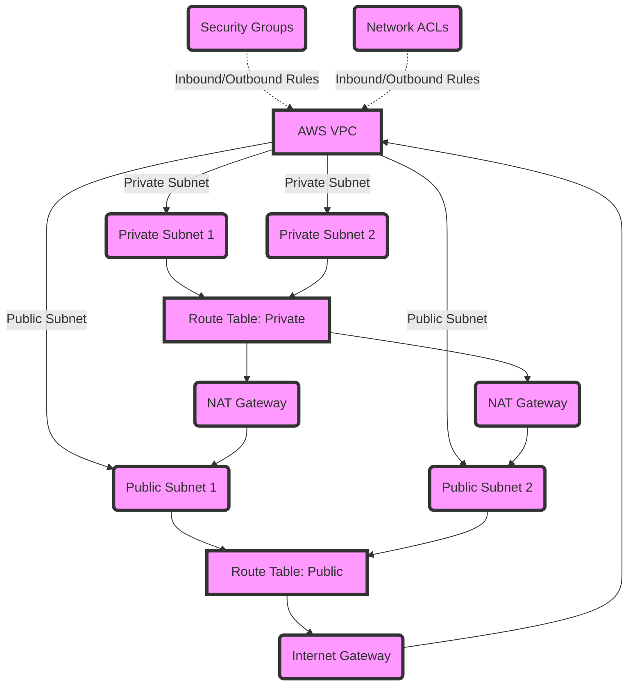

# Enhancing Network Documentation with Mermaid Diagrams and GitHub Hyperlinks

In the realm of network architecture and infrastructure documentation, clarity and accessibility are paramount. Traditional documentation methods, while effective, often struggle to keep pace with the dynamic changes in network configurations and the demands for faster information retrieval. Enter the power of Mermaid diagrams coupled with GitHub hyperlinks—an innovative approach that leverages the simplicity of text-based diagrams with the rich, interactive capabilities of web-based hyperlinks. This combination offers a highly discoverable, easily updatable, and interactively detailed view of network architecture, directly linking each component within the diagram to its comprehensive documentation on GitHub.

## What Are Mermaid Diagrams?

Mermaid is a lightweight, markdown-like language that enables the creation of diagrams and flowcharts using text and code. It simplifies the process of generating diagrams, making them easy to edit and version-control within documentation files, particularly in markdown format. When used in GitHub repositories, Mermaid diagrams are automatically rendered, providing an immediate visual representation of the written code.

## The Power of Hyperlinks in Documentation

Hyperlinks within documentation serve as portals to additional information, offering a depth of details without cluttering the primary view. They allow document viewers to explore topics further at their own pace, making documentation more interactive and user-directed.

## Combining Mermaid with GitHub Hyperlinks for Network Documentation

Integrating Mermaid diagrams with GitHub hyperlinks can transform how network architectures are documented and understood. Each component within a Mermaid diagram can link to a specific README.md file in a GitHub repository dedicated to that component. This setup not only visualizes the network's structure but also provides easy access to the details, configurations, and documentation of each element.

### Step 1: Setting Up Your GitHub Repositories

For every major component of your network architecture, create a GitHub repository. Within each repository, maintain a README.md file that details the configuration, purpose, and any other relevant information about the component.

### Step 2: Creating a Mermaid Diagram

Using Mermaid syntax, outline your network architecture in a markdown file. Here’s a simple example of what that might look like:

### Benefits

* Up-to-Date Documentation: Any updates in the component's repository are immediately reflected in the linked documentation, ensuring that the documentation is always current.
* Ease of Navigation: Viewers can quickly find detailed documentation for any component with just a click, enhancing discoverability and accessibility.
* Simplified Updates: Changes to the network architecture are easily made within the Mermaid diagram and the GitHub repositories, streamlining the update process.

# Conclusion

Integrating Mermaid diagrams with GitHub hyperlinks for documenting network architecture harnesses the best of both tools—visual representation with Mermaid and in-depth, easily accessible documentation through GitHub. This approach not only streamlines the creation and maintenance of network documentation but also significantly enhances its usability and accessibility, making it an invaluable strategy for network administrators and IT professionals.

